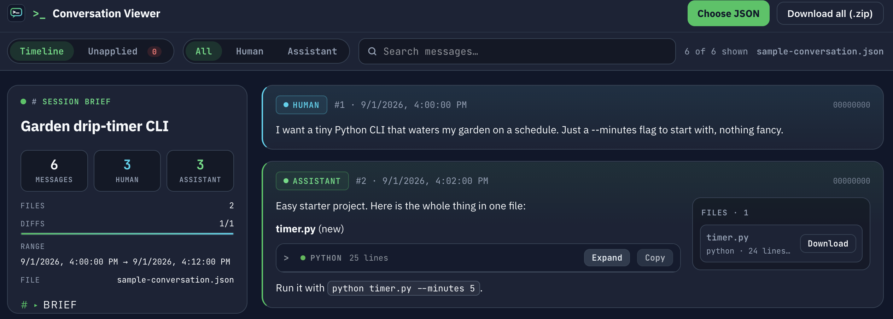

# CodeGlean

> Your web chats wrote code you never saved. Glean it back.


<!-- Screenshot placeholder: replace docs/screenshot.png with a real capture of CodeGlean. -->

**[Live demo](https://s96Abrar.github.io/codeglean/)** · [Sample conversation](sample-conversation.json)

Long web-based sessions (Claude web, no local code mode) happily create and edit files that never land on your disk — they live on as scattered full files and `+`/`-` diffs buried in chat history. Copy-pasting them back one by one is slow, error-prone, and the diffs were never meant to apply with `git apply`.

CodeGlean fixes that: drop in the exported `Conversation.json` and it replays every file change in chronological order, reconstructs the complete file at every step, and hands you the newest state of everything as a single `.zip` — ready to drop into your repo and continue locally.

## When to use it

- A long web session produced real code, but you never ran it in local code mode.
- You want the final state of every touched file without copy-pasting dozens of chat blocks.
- You need to audit what actually changed across a sprawling conversation before committing anything.
- You're moving work from the browser into your local repo and want a clean handoff point.

## How it works

1. **Parse** — the export becomes a two-column timeline: session brief with live stats on the left, every human/assistant message oldest-first on the right.
2. **Replay** — code fences tagged `**path/to/file** (new)` seed a file; `(diff)` fences are converted into real unified-diff patches (each edit independently anchored against the current file, never guessed) and applied via a vendored patch engine, so each message shows the full file *as it existed at that point*.
3. **Recover** — download any single file beside its message, open the **Unapplied diffs** section to review hunks that couldn't be reconstructed (with reasons, oldest-first), or export the newest state of all files as a `.zip`.

## Highlights

- **Session brief sidebar** — title, message counts, files tracked, diff success rate with progress bar, and the conversation summary (collapsed by default).
- **Full-file reconstruction** — diffs replayed in order, so you see complete files instead of raw patches. Unresolvable hunks keep a clear "not applied" badge and a dedicated review section.
- **Download anything** — single files per message, or the whole recovered tree as a `.zip`.
- **Fast search & filters** — instant text search, Human / Assistant toggles, and a Timeline / Unapplied view switch with live counts.
- **Dark developer aesthetic** — JetBrains Mono + IBM Plex Sans, near-black code blocks, status badges, zero emoji.
- **GPU-light by design** — no backdrop blur, no animations, no glow shadows; just flat colors and borders, so even huge conversations scroll smoothly.
- **100% private** — everything parses locally in your browser. No uploads, no tracking, no backend.

## Try it now

No build step, no install:

1. Open the [live demo](https://s96Abrar.github.io/codeglean/) — it loads the bundled `sample-conversation.json` automatically.
2. Or clone and open locally:
   ```bash
   git clone https://github.com/s96Abrar/codeglean.git
   cd codeglean
   npx serve .   # or: python3 -m http.server
   ```
3. Drop any `Conversation.json` export onto the page (or use **Choose JSON**) to recover your own files.

> Browsers block `fetch()` on `file://`, so opening `index.html` directly won't auto-load the sample — use a local server or drag & drop instead.

## Command-line (no browser)

Prefer a script over a UI, or want this in CI? `reconstruct.js` runs the exact same resolution pipeline headlessly under Node:

```bash
node reconstruct.js Conversation.json --out recovered      # writes every file under recovered/
node reconstruct.js Conversation.json --out recovered --zip # ...or bundles them into recovered/reconstructed.zip
```

Either way you also get one `<path>.<n>.rej` file per diff that couldn't be applied (original pseudo-diff + reason, à la `patch --reject`) and an `UNRESOLVED.md` manifest. Exits non-zero if anything failed to apply, so it's safe to gate on in a script.

For debugging a single file's reconstruction step by step:

```bash
node reconstruct.js Conversation.json --trace AppDelegate.swift --out trace
```

Writes that file's whole history: the initial full file, then one real `git diff`-style unified patch per message that touches it (`AppDelegate.swift.<message_order>.<message_id>`), then the final state as `AppDelegate.swift.final`.

## Expected JSON format

```jsonc
{
  "uuid": "...",
  "name": "Conversation title",
  "summary": "Optional overview text",
  "created_at": "2026-09-01T10:00:00Z",
  "updated_at": "2026-09-01T11:00:00Z",
  "account": { "uuid": "..." },
  "chat_messages": [
    {
      "uuid": "...",
      "text": "Message text (used for human messages)",
      "content": [{ "type": "text", "text": "Assistant text blocks" }],
      "sender": "human | assistant",
      "created_at": "2026-09-01T10:00:00Z",
      "updated_at": "2026-09-01T10:00:00Z",
      "attachments": [],
      "files": [],
      "parent_message_uuid": "00000000-0000-4000-8000-000000000000"
    }
  ]
}
```

Code fences tagged `**path/to/file** (new)` or `**path/to/file** (diff)` are picked up for reconstruction and downloads. See [`sample-conversation.json`](sample-conversation.json) for a minimal working example.

## Deploy to GitHub Pages

1. Push this folder to a repo named `codeglean` (don't commit private `Conversation.json` exports).
2. Go to **Settings → Pages → Deploy from a branch**, select `main` / root.
3. CodeGlean is live at `https://s96Abrar.github.io/codeglean/`.

All paths are relative, so project-site subpaths work out of the box. On load the app tries `Conversation.json`, then `conversation.json`, then the bundled `sample-conversation.json`.

## Project layout

| File | Purpose |
|---|---|
| `index.html` | Two-column shell: sticky topbar, brief sidebar, timeline |
| `style.css` | Dark theme, GPU-light (no blur, no animations) |
| `app.js` | Parsing, rendering, search, filters, downloads |
| `resolve.js` | Chronological diff replay → full-file reconstruction |
| `reconstruct.js` | Headless Node CLI wrapping the same pipeline (`--zip`, `--trace`) |
| `icon.svg` | Project icon (also used as favicon) |
| `sample-conversation.json` | Tiny demo conversation, loaded when no export is present |
| `docs/screenshot.png` | Screenshot placeholder — replace with a real capture |
| `.nojekyll` | Tells GitHub Pages to serve files exactly as-is |

## License

MIT — glean freely, and commit what the browser wouldn't.
